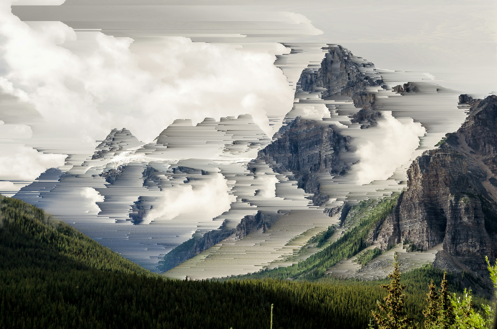
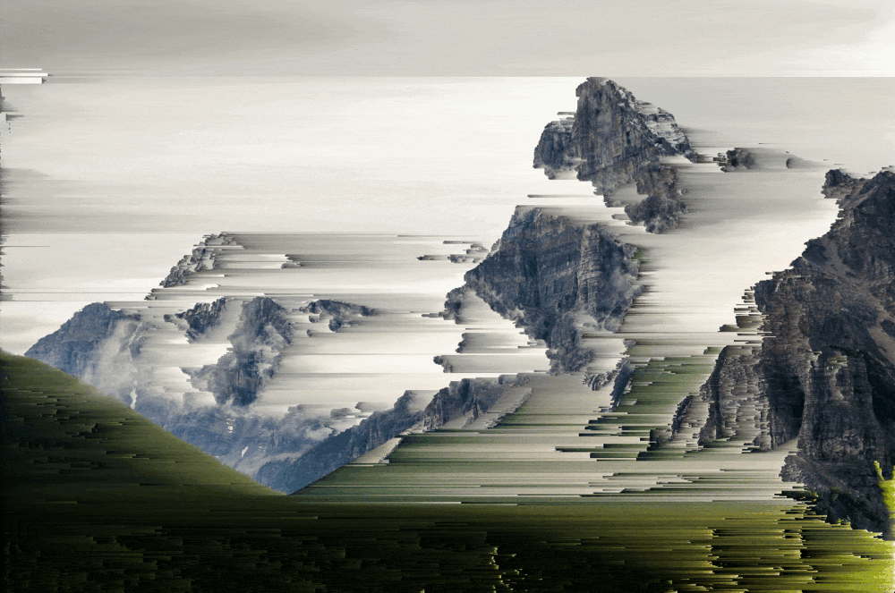
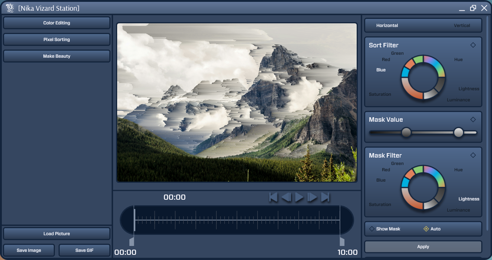
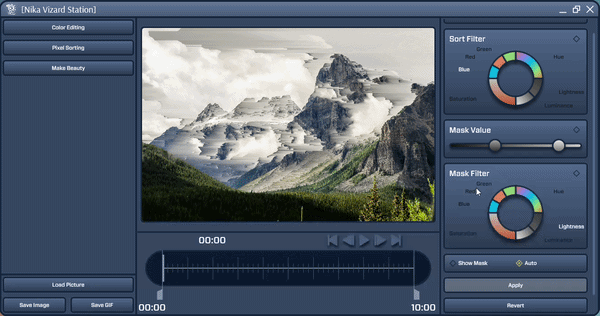

<p align="center">
  
</p>

# PixelSortStation

**A desktop playground for pixel sorting, glitch art, and animated image effects.**

Turn a photograph into flowing pixel streaks, experiment with color, and bring the result to life with keyframe animation. PixelSortStation is a personal project built with **C# and WPF**, combining custom image-processing algorithms with an interactive Windows editor.

## Before & after

Pixel sorting rearranges pixels within selected regions of an image. Masks control where the effect appears, preserving some details while stretching others into abstract patterns.

| Original photograph | Pixel-sorted result |
| :---: | :---: |
|  |  |

*Example photograph: Matheus Bandoch / Unsplash. Processing and demo captures made with PixelSortStation.*

## From a photograph to an animation

An example GIF exported directly from the application:
<details>
<summary><strong>Animated preview — rapid motion and flashing effects</strong></summary>
  
<p align="center">
  
</p>
</details>

## The editor

The workspace brings together an image preview, sorting and mask controls, color tools, and an animation timeline.



<details>
<summary><strong>Watch the editor in action</strong></summary>

A screen recording of the application in use:



</details>

## Features

- **Pixel sorting:** horizontal or vertical sorting by RGB channels, hue, lightness, saturation, or luminance.
- **Selective masks:** a separate mask channel and threshold range, with a mask preview.
- **Color editing:** brightness, contrast, saturation, hue, inversion, fade, temperature, and sharpening.
- **Color curves:** five-point curves for combined RGB or individual color channels.
- **Keyframe animation:** animate effect parameters, scrub the timeline, and preview changes.
- **Make Beauty:** generate random combinations of color and sorting effects, including animated variations.
- **Export:** PNG and JPEG still images, plus animated GIFs.

All image processing runs locally. No account, API keys, or cloud services are required.

## Run the compiled application

You can run the prebuilt Windows application directly — **no Visual Studio or .NET SDK is needed**.

1. Extract the complete application archive into a folder if you received a ZIP or RAR package.
2. Open that folder and double-click the application executable. The existing build is named **`Nika Vizard Station.exe`**.
3. If Windows asks for a runtime, install **.NET Desktop Runtime 6.0** for the architecture of your build from [Microsoft's download page](https://dotnet.microsoft.com/en-us/download/dotnet/6.0), then launch the executable again.

Keep the executable together with its DLLs, `.deps.json`, `.runtimeconfig.json`, `runtimes`, and `assets` folders. Copying just the `.exe` is not enough. Renaming an old executable alone does not update the application branding or its companion files.

In the original local project, the existing compiled application is at:

```text
Nika Vizard Station/bin/Release/net6.0-windows/Nika Vizard Station.exe
```

Compiled files are excluded from source control, so a source-only download requires the build steps below. Screenshots and recordings show the earlier Nika Vizard Station name.

## Build from source

### Requirements

- **Windows** — the application uses WPF.
- A .NET SDK capable of building `net6.0-windows`. The project was built successfully with SDK `10.0.301`.
- **.NET Desktop Runtime 6.0** to run this version. A newer runtime alone does not replace it. Available from [Microsoft's .NET 6 download page](https://dotnet.microsoft.com/en-us/download/dotnet/6.0).
- Internet access for the initial NuGet restore.

Download or clone the repository, then open PowerShell in the folder containing `Nika Vizard Station.sln`:

```powershell
dotnet restore ".\Nika Vizard Station.sln"
dotnet build ".\Nika Vizard Station.sln" -c Release --no-restore
dotnet run --project ".\Nika Vizard Station\Nika Vizard Station.csproj" -c Release --no-build
```

Alternatively, open the solution in Visual Studio with the **.NET desktop development** workload and the required .NET 6 targeting components, then run the project. NuGet restores the dependencies automatically.

## Try it

1. Click **Load Picture** and open a PNG or JPEG.
2. Open **Pixel Sorting**, choose a direction and a sorting channel.
3. Choose a **Mask Filter** and adjust its range. Use **Show Mask** to inspect the selection, then turn it off to see the effect.
4. Click **Apply**, or enable **Auto** for preview updates while adjusting the controls.
5. Use **Save Current** to make the current effect the working image for further edits. Open **Color Editing** to experiment with colors and curves.
6. Click **Save Image** to export the result. **Save Current** commits an edit inside the app; it does not write a file.

For a random starting point, open **Make Beauty**, enable Pixel Sorting and/or Color Editing, adjust the strength, and click **Make Beauty!**.

### Make an animation

Enable the animation checkbox for a parameter, move the timeline to a starting position, and drag its slider to record a value. Move to a later position and change the slider again to add another keyframe. Preview the result, set the timeline start and end, and click **Save GIF**.

Numeric parameters interpolate between keyframes. The sorting-channel and mask-channel animation toggles cycle through predefined channels.

## Technical highlights

- Custom pixel sorting across contiguous masked regions, with horizontal and vertical processing.
- Bitmap and color-channel utilities for pixel-level image manipulation.
- Curve-based color transformations and parameter interpolation between keyframes.
- A WPF interface with custom controls, value converters, and timeline interactions.
- Frame caching for animation previews and Magick.NET for GIF encoding.

The main implementation lives in `MainWindow.xaml` and `MainWindow.xaml.cs`. Processing helpers are organized under `Services/SortingPixel`, `Services/ColorChanging`, and `Services/ImageInformation`; `AnimationService.cs` handles interpolation and `RandomService.cs` generates effect settings.

**Stack:** C# · WPF · .NET 6 · System.Drawing.Common · Magick.NET

## Project notes

The current version targets .NET 6, which is out of support, and uses an older Magick.NET version with known vulnerability advisories. Dependency modernization is a future improvement.

GIF export fits frames within 1000 × 1000 pixels, uses a 256-color palette, and applies a fixed 150 ms frame delay. Large images and long animations can use significant memory. Editable project files and saved animation presets are not currently supported.


